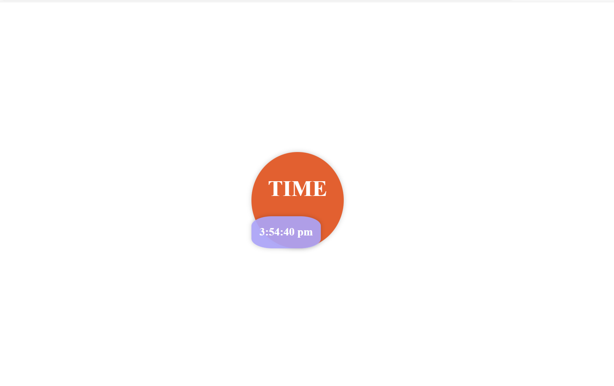

## Understanding the Code and `setInterval`

### Code Breakdown:

```javascript
const clock = document.getElementById("clock");
setInterval(function () {
  const date = new Date();
  clock.innerHTML = date.toLocaleTimeString();
}, 1000);
```

1. **`const clock = document.getElementById("clock");`**
   - Selects an HTML element with the id "clock" and stores it in the `clock` variable. This element will be used to display the time.

2. **`setInterval(function () { ... }, 1000);`**
   - This line employs the `setInterval` function to execute the enclosed code block every 1000 milliseconds (1 second).

   - Inside the function:
     - `const date = new Date();` creates a new Date object representing the current date and time.
     - `clock.innerHTML = date.toLocaleTimeString();` converts the date object to a localized time string (e.g., "12:34:56 PM") and updates the content of the "clock" element with this string.

### What is `setInterval`?

- `setInterval` is a JavaScript function that repeatedly executes a specified code block after a fixed delay. 
- It returns an interval ID, which can be used to stop the interval using `clearInterval`.
- Syntax: `setInterval(function, milliseconds)`
  - `function`: The code to be executed repeatedly.
  - `milliseconds`: The time interval between executions in milliseconds.

### Key Points:

- The code continuously updates the content of the element with the id "clock" to display the current time.
- The time is updated every second due to the 1000 milliseconds interval.
- `toLocaleTimeString()` provides a localized time representation based on the user's locale settings.

### Potential Improvements:

- **Efficiency:** If performance is critical, consider using `requestAnimationFrame` instead of `setInterval` for smoother animations.
- **Time Format Customization:** Explore `toLocaleTimeString` options to customize the time format (e.g., 24-hour format, adding seconds, etc.).
- **Error Handling:** Implement error handling to gracefully handle potential issues (e.g., if the "clock" element is not found).

**Would you like to explore any of these points further, or do you have any other questions about the code or `setInterval`?**
