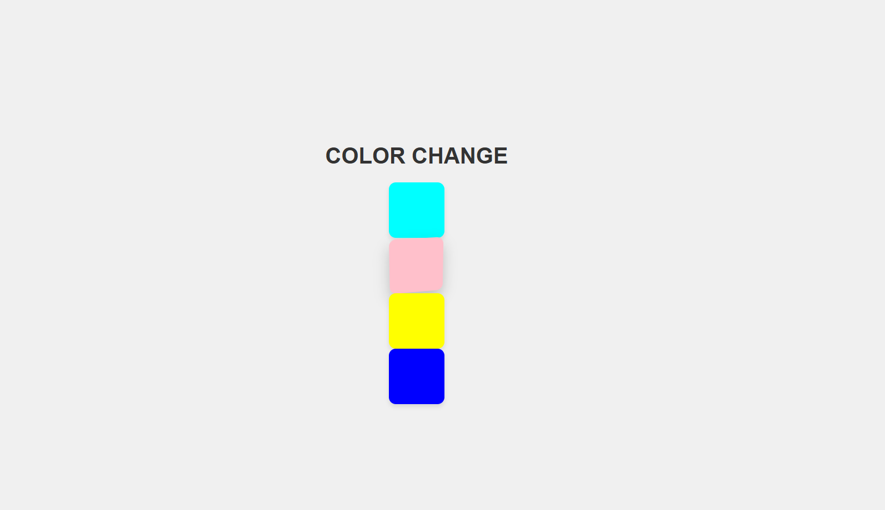
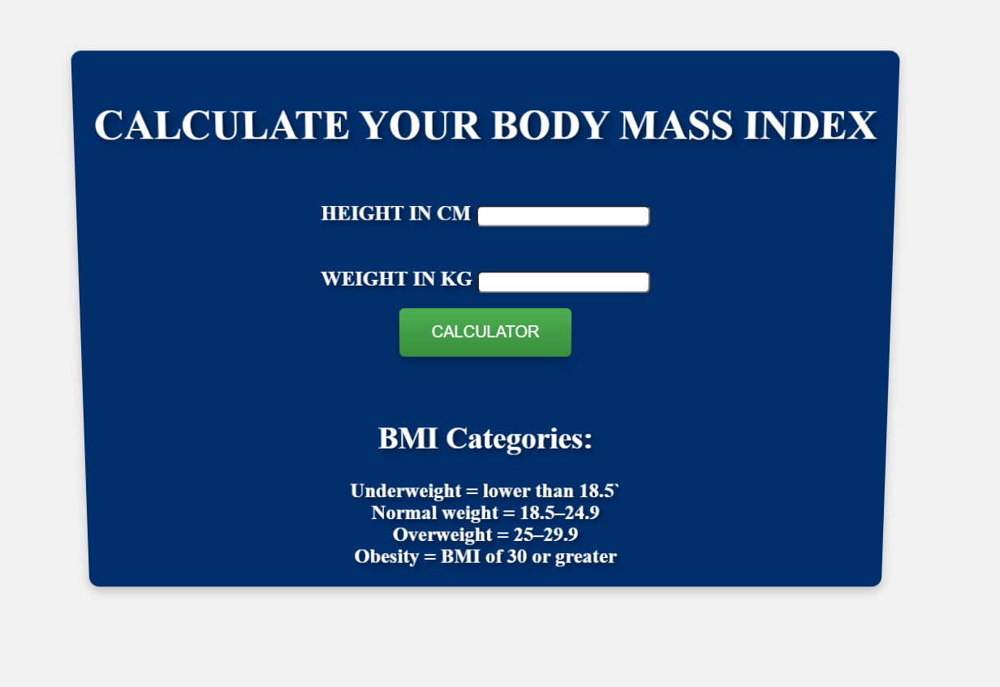

Here's a 30-day JavaScript project plan that will take you from beginner to advanced levels, incorporating React.js as you progress. Each day will focus on a specific project or concept, progressively increasing in complexity.

### Week 1: Fundamentals and Basic JavaScript Projects
**Day 1:** **color changer**

**Day 2:** **BMI CALCULATOR**

**Day 2:** **Calculator (Basic)**
- Build a basic calculator using vanilla JavaScript
- Implement addition, subtraction, multiplication, and division

**Day 3:** **To-Do List (Basic)**
- Create a to-do list with add and delete functionality
- Use arrays to manage the list items

**Day 4:** **Digital Clock**
- Build a digital clock that displays the current time
- Use `setInterval` to update the time every second

**Day 5:** **Weather App (Part 1)**
- Fetch weather data from a public API (e.g., OpenWeatherMap)
- Display the current weather for a specific location

**Day 6:** **Weather App (Part 2)**
- Add a search functionality to fetch weather data for different locations
- Handle errors and edge cases

**Day 7:** **Number Guessing Game**
- Create a number guessing game where the user has to guess a random number between 1 and 100
- Provide feedback on whether the guess is too high or too low

### Week 2: Intermediate JavaScript Projects
**Day 8:** **Quiz App (Part 1)**
- Create a quiz application with multiple-choice questions
- Display one question at a time with options

**Day 9:** **Quiz App (Part 2)**
- Track the score and display the result at the end
- Use an array to store questions and answers

**Day 10:** **Memory Game (Part 1)**
- Build a memory card game (like the classic Concentration game)
- Display a grid of cards that flip on click

**Day 11:** **Memory Game (Part 2)**
- Implement the logic to check for matching pairs
- Track the number of attempts and display the result

**Day 12:** **Recipe App (Part 1)**
- Create a recipe search app using an API (e.g., Edamam)
- Display a list of recipes based on user input

**Day 13:** **Recipe App (Part 2)**
- Display detailed information for each recipe
- Add loading indicators and error handling

**Day 14:** **Expense Tracker**
- Build an expense tracker with add, edit, and delete functionality
- Calculate and display the total expenses

### Week 3: Advanced JavaScript and Introduction to React
**Day 15:** **Weather App with React (Part 1)**
- Rebuild your weather app using React
- Set up a new React project and create components

**Day 16:** **Weather App with React (Part 2)**
- Implement state management with `useState` and `useEffect`
- Fetch and display weather data

**Day 17:** **To-Do List with React**
- Rebuild your to-do list app using React
- Use state management to handle adding and deleting items

**Day 18:** **Movie Search App (Part 1)**
- Create a movie search app using a public movie API and React
- Implement search functionality and display results

**Day 19:** **Movie Search App (Part 2)**
- Display detailed information for selected movies
- Add loading indicators and error handling

**Day 20:** **Shopping Cart (Part 1)**
- Build a shopping cart interface using React
- Implement add to cart functionality

**Day 21:** **Shopping Cart (Part 2)**
- Update item quantities in the cart
- Calculate and display the total price

### Week 4: Advanced React Projects
**Day 22:** **Authentication System (Part 1)**
- Set up a basic authentication system with React
- Create login and registration forms

**Day 23:** **Authentication System (Part 2)**
- Implement protected routes
- Use context or Redux for global state management

**Day 24:** **Portfolio Website with React (Part 1)**
- Create a personal portfolio website using React
- Add a home and about page

**Day 25:** **Portfolio Website with React (Part 2)**
- Add a projects section with dynamic content
- Implement a contact form

**Day 26:** **Blog App with React (Part 1)**
- Create a blog app with CRUD functionality using React
- Implement create and read posts

**Day 27:** **Blog App with React (Part 2)**
- Add update and delete post functionality
- Style the app using CSS or Tailwind CSS

**Day 28:** **Real-time Chat Application (Part 1)**
- Set up a real-time chat application using React and WebSockets
- Create a simple chat interface

**Day 29:** **Real-time Chat Application (Part 2)**
- Implement message sending and receiving
- Add user authentication

**Day 30:** **Final Project**
- Combine all learned concepts to build a comprehensive project of your choice
- Use advanced state management with Redux or Context API

### Additional Tips
- **Documentation:** Document your code and write README files for your projects.
- **Code Reviews:** Get your code reviewed by peers or mentors.
- **Learning Resources:** Utilize resources like official JavaScript and React documentation, tutorials, and courses.
- **Community Involvement:** Join JavaScript and React communities, participate in discussions, and ask for feedback.

This plan should provide a structured path to enhance your JavaScript and React skills from beginner to advanced levels.
